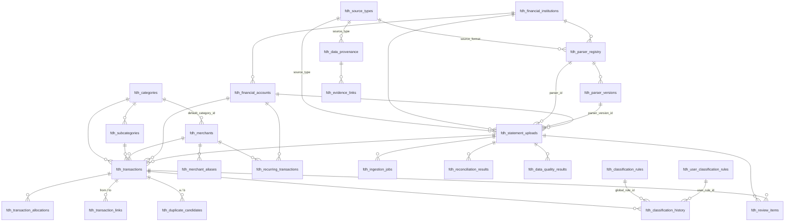

# FDH-1 — Database Schema

**Migrations:** `0045`–`0048` (see `../architecture/MIGRATION_REGISTRY.md` §3
for how those numbers were chosen).
**Tables added:** 24. **Existing tables altered: 0.**

---

## 1. Naming decision

**Decision: prefix every table `fdh_`.**

This was not applied mechanically. The existing schema was inspected first:

* `main`'s 77 tables are mostly unprefixed (`assets`, `income_sources`) with
  domain-clustered names elsewhere (`goal_*`, `forecast_*`, `report_*`,
  `benchmark_*`, `financial_twin_*`).
* The two unmerged parallel modules both adopted a module prefix — `ii_*` for
  Investment Intelligence, `resource_*` for the Resources CMS.

A prefix is justified here because it satisfies all five stated requirements:

| Requirement | How the `fdh_` prefix satisfies it |
| --- | --- |
| No collision | No existing or unmerged table starts with `fdh_`; verified across `main`, both II branches and both Resources branches |
| Clear ownership | Every `fdh_` table is FDH's; nothing else touches them |
| Easy distinction from Input Data | `fdh_transactions` cannot be mistaken for `expense_items`, and `fdh_financial_accounts` cannot be mistaken for `assets` |
| Easy future maintenance | One `drop table fdh_*` is the whole rollback surface |
| No duplicate investment ownership | `fdh_` visibly is not `ii_`, so a reviewer can see at a glance which module owns a table |

**Other conventions inherited, not invented:**

* Enums are `text` + `check (x in (...))`. There is no `create type … as enum`
  anywhere in migrations `0001`–`0030`, and FDH does not introduce one.
* Enum values are lowercase `snake_case`, like every existing table. The
  specification writes them in `UPPER_CASE`; the mapping is 1:1 and is tabulated
  in `FDH1_DOMAIN_MODEL.md` §2.
* Country codes are ISO-3166-1 alpha-2 (`AU`, `IN`) via
  `countries.country_code`; currencies are ISO-4217 via
  `currencies.currency_code`. No second convention was introduced.
* Primary keys are `uuid … default gen_random_uuid()`.
* `created_at` / `updated_at` are `timestamptz not null default now()`.

## 2. Relationship diagram

## 3. Privacy classification, per table

| Class | Meaning |
| --- | --- |
| **PMD** — Public master data | Shared reference; readable by any session; no personal data |
| **IMD** — Internal master data | Shared reference with governance/operational meaning |
| **HFD** — Household financial data | A specific person's money. Owner-only, never admin-readable |
| **OPM** — Operational metadata | Describes processing, not content. The only class an admin may ever see |
| **STD** — Sensitive temporary data | Raw source material, deleted by the retention lifecycle |
| **AUD** — Audit data | Append-only record of who changed what |

| Table | Class | Fields expected to be purged later |
| --- | --- | --- |
| `fdh_source_types` | PMD | — |
| `fdh_financial_institutions` | PMD | — |
| `fdh_categories` | PMD | — |
| `fdh_subcategories` | PMD | — |
| `fdh_merchants` | PMD | — |
| `fdh_merchant_aliases` | PMD | — |
| `fdh_classification_rules` | IMD | — |
| `fdh_parser_registry` | IMD | — |
| `fdh_parser_versions` | IMD | — |
| `fdh_financial_accounts` | HFD | — (`masked_identifier` is already minimised) |
| `fdh_statement_uploads` | HFD + OPM + **STD** | `raw_document_storage_reference`, `original_filename_sanitised` |
| `fdh_ingestion_jobs` | OPM | — |
| `fdh_transactions` | HFD + **STD** | `description_raw`, `merchant_raw` |
| `fdh_transaction_allocations` | HFD | — |
| `fdh_transaction_links` | HFD | — |
| `fdh_duplicate_candidates` | HFD | — |
| `fdh_user_classification_rules` | HFD | — |
| `fdh_classification_history` | AUD | — (never purged: it is the user-correction record) |
| `fdh_recurring_transactions` | HFD | — |
| `fdh_review_items` | HFD | — (`context_json` is a closed shape carrying no raw text) |
| `fdh_reconciliation_results` | HFD | — |
| `fdh_data_quality_results` | OPM | — |
| `fdh_data_provenance` | HFD + AUD | — |
| `fdh_evidence_links` | HFD | — |

`fdh_statement_uploads` is the only table that is simultaneously household data
*and* the source of the admin operational-metadata projection. The split is
column-level and is enforced by an allowlist — see `FDH1_RLS_SECURITY.md` §5.

## 4. Tables

Every user-owned table below carries
`user_id uuid not null references auth.users(id) on delete cascade`,
`household_id uuid references households(id) on delete set null` (optional
context, never an RLS predicate), RLS enabled, and the standard owner-only
policy `for all using (auth.uid() = user_id) with check (auth.uid() = user_id)`.
Only deviations are called out.

### 4.1 `fdh_source_types` — PMD
The import mechanism, kept separate from the institution.
**PK** `source_type_key` (text). **Fully seeded** in migration `0045` (9 rows) —
a closed technical vocabulary, not a content library.
**RLS** read-only (`for select using (true)`); no write policy.
**Deletion** `on delete restrict` from every referring table — a source type in
use cannot be removed.

### 4.2 `fdh_financial_institutions` — PMD
**PK** `id`. **FK** `country_code → countries` (restrict).
**Unique** `(country_code, institution_code)` — "SBI" in India and a
hypothetical "SBI" in Australia are different institutions.
**Index** `(country_code, institution_type) where active`.
**Critical fields** `institution_type` (11 values incl. `broker`,
`investment_platform`, `depository`, `mutual_fund_platform` — *document
acquisition*, not an investment ledger; see `FDH1_INVESTMENT_BOUNDARY.md`).
**Not seeded** in any migration. Four TEST FIXTURE rows live in
`supabase/seed_fdh_test_fixtures.sql`, which is not a migration.

### 4.3 `fdh_categories` / 4.4 `fdh_subcategories` — PMD
**Unique** `category_key`; `(category_id, subcategory_key)`.
**Critical fields** `category_key` / `subcategory_key` are **stable machine
keys, never display labels** — renaming a label must never repoint history.
`country_applicability char(2)[]` with a check that it is non-empty and a
subset of `{AU, IN}`. `fhip_mapping_key` is forward-looking metadata for the
FDH-15 bridge and **is read by nothing**; recording it creates no integration.
**Deletion** subcategories cascade from their category.
**Not seeded** beyond two TEST FIXTURE categories and one subcategory. The
exhaustive AU/India library is FDH-2.

### 4.5 `fdh_merchants` — PMD
**Unique** two partial indexes: `(country_code, canonical_name)` where the
country is present, and `(canonical_name)` where it is null — a single
constraint would let two country-neutral duplicates through, because Postgres
never equates two NULLs.
**Critical fields** `verification_status` is the governance lifecycle
(`proposed → admin_review → approved | rejected | merged`), with
`chk_fdh_merchants_merge_target` requiring a surviving record when merged and
`chk_fdh_merchants_no_self_merge` forbidding a self-merge. `mcc` is checked as
exactly four digits.
**RLS** read-only. **This is the structural enforcement of "a user correction
must never automatically become a global rule": no INSERT or UPDATE policy
exists for the authenticated role at all.**

### 4.6 `fdh_merchant_aliases` — PMD
Many narratives to one canonical merchant.
**Unique** `(merchant_id, alias_normalised, coalesce(country_code,'**'))`.
**Index** `(alias_normalised, country_code)` — the lookup a future classifier
performs. **Deletion** cascades from the merchant.

### 4.7 `fdh_classification_rules` — IMD
Centrally governed global rules.
**Unique** `rule_key`. **Index** `(rule_type, priority) where active and status = 'approved'`.
**Critical constraints** `match_definition` and `action_definition` must be
JSON **objects** carrying `match_kind` / `action_kind`. They are data, never an
executable expression, and the closed vocabulary carries **no regex member** —
an unbounded regular expression evaluated over every user's narratives is a
denial-of-service vector.

### 4.8 `fdh_parser_registry` / 4.9 `fdh_parser_versions` — IMD
**Unique** `parser_key`; `(parser_id, version)`.
**Check** `retired_at >= introduced_at`.
**Deletion** versions cascade from their parser; a parser referenced by a
processed document is `restrict`ed.
**Governing principle** *institution support is not one successful document* —
every processed statement retains both `parser_id` and `parser_version_id`, so
a later layout change is attributable and reprocessable.
**No parser code exists.** The single fixture version is `development`, never
`certified`.

### 4.10 `fdh_financial_accounts` — HFD
**FK** `institution_id` (restrict), `country_code`/`currency_code` (restrict).
**Unique** `(user_id, account_fingerprint)` partial, where the fingerprint is
present.
**Indexes** `(user_id)`, `(user_id, institution_id)`.
**Critical constraints**
* `chk_fdh_accounts_masked_identifier` — `masked_identifier !~ '[0-9]{7,}'`.
  A real database control, not a comment: an AU BSB+account (6+9 digits) and an
  Indian account number (11–18 digits) cannot be stored; `****1234` can.
* `chk_fdh_accounts_dates` — `closed_at >= opened_at`.
**Absent by design** there is no `full_account_number`, `bsb`, `ifsc` or `iban`
column. `account_fingerprint` is reserved for a future **non-reversible keyed
hash** and is **not populated in FDH-1** — no key-management/HMAC
infrastructure exists in this repository yet. Any genuine temporary need for a
full identifier during parsing belongs to FDH-3's secure processing lifecycle.

### 4.11 `fdh_statement_uploads` — HFD + OPM + STD
**Metadata only.** No document bytes, no page images, no OCR artefacts.
**FK** `financial_account_id` (set null — the account is unknown until the
document is classified), `institution_id`/`parser_id`/`parser_version_id`
(restrict), `source_type` (restrict).
**Unique** `(user_id, file_hash)` partial — the same file uploaded twice is a
duplicate, not a new document.
**Indexes** `(user_id)`, `(user_id, processing_status)`,
`(financial_account_id)`, `(parser_id, parser_version_id)`, and a partial index
on `raw_document_purge_due_at` restricted to purgeable states so the sweep query
stays small.
**Critical constraints**
* `chk_fdh_uploads_purged_reference` — a row cannot claim
  `raw_document_purge_status = 'purged'` while `raw_document_storage_reference`
  is still set. The purge contract is enforced by the database.
* `chk_fdh_uploads_purged_at` — `raw_document_purged_at` only in the purged state.
* `chk_fdh_uploads_period` — `statement_period_end >= statement_period_start`.
* `chk_fdh_uploads_approved_at` — `approved_at` only once approved or beyond.
* `file_size_bytes > 0`.
* `error_code` restricted to the 14-value controlled taxonomy — never a stack
  trace.
**Deletion** child jobs, review items, reconciliation and quality rows cascade;
transactions `set null` (a transaction outlives its document, which is the
point of the purge model).

### 4.12 `fdh_ingestion_jobs` — OPM
**Indexes** `(user_id)`, `(statement_upload_id)`, and `(job_type, created_at)
where status = 'queued'` — the claim query a future worker will run.
**Checks** `attempt <= max_attempts`, `completed_at >= started_at`,
`max_attempts >= 1`. **No worker exists.**

### 4.13 `fdh_transactions` — HFD + STD
The canonical FDH transaction. **Indexes** `(user_id)`,
`(financial_account_id, transaction_date desc)` (the dominant query),
`(user_id, transaction_date desc)`, `(statement_upload_id)`, partial indexes on
`merchant_id` and `category_id`, and `(user_id, review_status) where review_status
in ('pending','in_review')` for the review queue.
**Critical constraints**
* `amount_original numeric(20,4) not null check (amount_original > 0)` — a
  strictly positive **magnitude**.
* `credit_debit` and `economic_transaction_type` are **two independent
  columns**. No constraint, index or code path ties them. A credit is not
  income; a debit is not an expense.
* `chk_fdh_txn_reporting_pair` — reporting amount and reporting currency travel
  together or not at all.
* `chk_fdh_txn_fx_pair` — an FX rate needs a reporting currency to mean
  anything. (The validation layer additionally refuses a rate with no date.)
* Two structurally distinct confidences, `extraction_confidence` and
  `classification_confidence`, both `numeric(5,4)` over `[0,1]`.
**Nullable by design** `description_raw`, `merchant_raw` — the purge lifecycle
depends on it.

### 4.14 `fdh_transaction_allocations` — HFD
**Unique** `(transaction_id, allocation_sequence)`. **Check** `amount > 0`,
`percentage` in `(0,100]`. **Deletion** cascades from the transaction.
**Completeness is deliberately NOT a database constraint** — allocations are
edited incrementally and a row-level rule would make a half-entered split
unsaveable. It is enforced at finalisation by
`assertAllocationsReconcile()` with an explicit smallest-currency-unit
tolerance.

### 4.15 `fdh_transaction_links` — HFD
**`transaction_id_to` is NULLABLE by design.** Statement A is imported in March
and a probable transfer out is seen, but the receiving account has not been
imported. The link persists with a null counterpart and stays open until
statement B arrives weeks later.
**Unique** two partial indexes — `(from, to, link_type)` where `to` is present,
and `(from, link_type)` where it is null, so two open links of the same type
cannot pile up.
**Index** `(user_id, link_type) where transaction_id_to is null and status = 'pending'`
— exactly the retry query a future matching engine runs.
**Check** `chk_fdh_links_not_self`.

### 4.16 `fdh_duplicate_candidates` — HFD
**Unique** `(transaction_id_a, transaction_id_b)`. **Checks** the two are
distinct, and a non-pending row must carry `resolved_at`. **No engine exists.**

### 4.17 `fdh_user_classification_rules` — HFD
Same structured-JSON constraints as `fdh_classification_rules`, plus an
`account_scoped_default` rule type. **Index** `(user_id, rule_type, priority)
where active`. This is the only place a user's own preference is stored; it
never propagates to master data.

### 4.18 `fdh_classification_history` — AUD
**RLS DEVIATION, DELIBERATE.** Two policies —
`for select using (auth.uid() = user_id)` and
`for insert with check (auth.uid() = user_id)` — and **no UPDATE or DELETE
policy at all**. Postgres denies any verb without a policy, so the owner can
append and read but cannot rewrite or erase their own audit trail. An audit
trail a user can edit is not an audit trail. Precedent for append-only intent
already exists (`audit_events`, `financial_records_audit`); FDH adds INSERT
because, unlike those two, this table is genuinely written by the session
client.
**Index** `(transaction_id, created_at desc)`, `(user_id)`.
`global_rule_id` and `user_rule_id` are two real foreign keys rather than one
polymorphic `rule_id`.

### 4.19 `fdh_recurring_transactions` — HFD
**Index** `(user_id, status)`, `(next_expected_date) where status = 'active'`.
**Check** an expected amount must state its currency. **No detection algorithm
exists.**

### 4.20 `fdh_review_items` — HFD
**Checks** must reference a document or a transaction; `context_json` must be a
JSON object; a resolved or dismissed item must carry `resolved_at`.
**Indexes** `(user_id, severity) where status in ('open','in_progress')`,
`(statement_upload_id)`, `(transaction_id)`, and
`(review_type, user_id) where status = 'open'` — the cross-session retry query.
`title_code` is a message key, never a sentence containing financial detail;
`context_json` is validated against a **closed, `.strict()` shape with no
free-text field**, so raw narrative cannot be stashed there and survive the
purge.

### 4.21 `fdh_reconciliation_results` — HFD
**Critical constraint** `chk_fdh_recon_reconciled`:
`status <> 'reconciled' or (variance is not null and abs(variance) <= variance_tolerance)`.
A failed reconciliation can never be stored as a success. `variance_tolerance`
defaults to `0` and must be set deliberately — it is not a hidden fudge factor.
Non-zero discrepancies are recorded as `failed` or as an explicit
`user_accepted_exception`.

### 4.22 `fdh_data_quality_results` — OPM
**Unique** `(statement_upload_id, check_code)` — one verdict per check per
document. **Index** partial on failures/warnings.

### 4.23 `fdh_data_provenance` — HFD + AUD
"Where did this number come from?"
**Standalone:** it references no FHIP Input Data register. The FDH-15 bridge
adds its own linkage when it exists.
`entity_id` is **polymorphic and deliberately carries no FK**; `entity_type`
names the table. The two frequent cases (`source_statement_id`,
`source_transaction_id`) *do* carry real foreign keys so the common lineage
query stays referentially safe.
**`evidence_completeness` lives here, not on a transaction**, because it is a
property of a derived fact. FDH-1 stores the number and hardcodes **no scoring
rule** — no 0.5-for-bank-only, no 1.0-for-payslip. That model is FDH-9.
**Indexes** `(entity_type, entity_id)`, `(user_id)`, `(source_statement_id)`,
`(source_transaction_id)`, `(parser_id, parser_version_id)`.

### 4.24 `fdh_evidence_links` — HFD
Many evidence sources supporting one provenance record — what makes
"salary evidence = bank credit + payslip" representable without inventing a
payslip table now. **Deletion** cascades from the provenance record.
**Payslip extraction is not implemented (FDH-9).**

## 5. Index rationale

Indexes were chosen from expected query shapes, not added speculatively:

| Query a later phase will run | Index |
| --- | --- |
| "this account's transactions in a date window" | `fdh_transactions(financial_account_id, transaction_date desc)` |
| "my transactions, newest first" | `fdh_transactions(user_id, transaction_date desc)` |
| "what still needs my review?" | partial indexes on `review_status` / `status` |
| "claim the next queued job of this type" | `fdh_ingestion_jobs(job_type, created_at) where status='queued'` |
| "which documents are due for purge?" | partial index on `raw_document_purge_due_at` |
| "retry unresolved transfer links" | `fdh_transaction_links(user_id, link_type) where to is null and pending` |
| "resolve this narrative to a merchant" | `fdh_merchant_aliases(alias_normalised, country_code)` |
| "provenance for this entity" | `fdh_data_provenance(entity_type, entity_id)` |
| tenant scoping on every table | `user_id` index (or a composite leading with it) |

Partial indexes are used wherever the interesting rows are a small minority
(open reviews, queued jobs, pending purges, unresolved links), which keeps them
small rather than duplicating the table.

## 6. JSON usage

JSON appears in exactly three columns, all genuinely flexible metadata:

| Column | Why JSON is right | Guard |
| --- | --- | --- |
| `fdh_classification_rules.match_definition` / `action_definition` | The shape differs per rule type | must be an object carrying `match_kind`/`action_kind`; a Zod discriminated union over a closed vocabulary; no regex/expression/SQL member |
| `fdh_user_classification_rules.*` | same | same |
| `fdh_review_items.context_json` | Context differs per review type | must be an object; validated against a `.strict()` closed shape with **no free-text field** |

**No core relational financial data is stored as JSON.** There is no
`all_transactions jsonb`, no `extracted_payload jsonb`, no `raw_rows jsonb`.
Amount, currency, date, direction, economic type, category, merchant, account
and document are all typed relational columns.

## 7. Timestamp standard

| Kind | Type | Examples | Why |
| --- | --- | --- | --- |
| Business date | `date` | `transaction_date`, `posting_date`, `value_date`, `statement_period_start/end`, `statement_as_of_date`, `opened_at`, `closed_at`, `next_expected_date`, `fx_rate_date` | Time of day is meaningless and a timezone would invent precision the statement never had (this is the class of bug that produced the AU/India date-format defect recorded in the 50-user E2E cycle) |
| Event instant | `timestamptz` | `created_at`, `updated_at`, `approved_at`, `started_at`, `completed_at`, `resolved_at`, `raw_document_purged_at`, `introduced_at`, `retired_at` | An event happened at a real instant; `timestamptz` is the platform convention from `0001` onwards |

## 8. Soft delete vs hard delete

The existing practice was determined, not assumed: the seven Input Data
registers grant DELETE at the database level but the application never
hard-deletes — `registry.archive()` sets `is_active = false`
(`lib/services/registry.ts:52-55`). Soft delete is an application convention.

FDH does **not** apply that blanket convention, because privacy-sensitive raw
material has different deletion semantics from ordinary master data:

| Data | Semantics | Why |
| --- | --- | --- |
| Raw document reference, raw filename, raw description, raw merchant | **Hard null** by the purge lifecycle | Retaining sensitive payload because an ORM convention prefers soft delete would defeat the entire retention model |
| Master data (`fdh_categories`, `fdh_merchants`, `fdh_financial_institutions`, `fdh_parser_registry`) | **Soft deactivate** via `active = false`, plus `merged` / `deprecated` states | A category still referenced by historical transactions must never vanish |
| Parser versions | **Soft** via `status` (`deprecated`, `disabled`) | A retired version must remain resolvable for provenance |
| `fdh_classification_history` | **Never deleted** | It is the record of the user's own corrections |
| Ordinary user rows | Owner may delete; cascades are explicit | The user owns their data |

Every foreign key declares an explicit `on delete` behaviour —
`cascade` (child of an owned parent), `set null` (an optional association whose
loss must not destroy the child) or `restrict` (reference data and parser
provenance, which must not disappear from under a record). This is asserted by
test, and it is a strict improvement on the pre-existing convention, where
reference-table foreign keys in migrations `0001`–`0030` leave the behaviour
implicit.

## 9. Financial precision

| Kind | Type | Range / scale |
| --- | --- | --- |
| Money | `numeric(20,4)` | up to 10^16 with four decimals — covers Indian crore-scale amounts and sub-paisa FX residue |
| FX rate | `numeric(20,10)` | positive; ten decimals |
| Confidence / score / weight | `numeric(5,4)` | closed `[0,1]`, enforced by check |
| Percentage (allocation) | `numeric(7,4)` | `(0,100]` |

**No `float`, `float4`, `float8`, `real`, `double precision` or `money` type
appears anywhere in the FDH schema**, asserted by
`tests/unit/fdh1SchemaContract.test.ts`. In TypeScript, money arithmetic is
performed in integer minor units (`lib/financial-data-hub/domain/money.ts`) so
that `sumMoney([0.1, 0.2], 'AUD') === 0.3`, which naive float addition does not
give.

## 10. Rollback

See `FDH1_COMPLETION_REPORT.md` §"Rollback Instructions".
